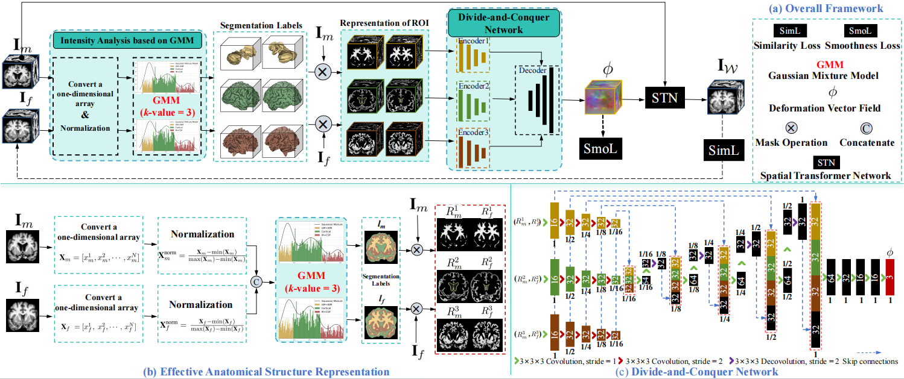

# EASR-DCN: Deformable Medical Image Registration with Effective Anatomical Structure Representation and Divide-and-Conquer Network

[Note!!]** The [pytorch](https://github.com/XinkeMa/EASR-DCN) version will be released soon and made publicly accessible! **

We propose a weakly-supervised ROI-based registration approach named EASR-DCN. Our method represents medical images through effective ROIs and achieves independent alignment of these ROIs without requiring labels. Specifically, we first used a Gaussian mixture model for intensity analysis to represent images using multiple effective ROIs with distinct intensities. Furthermore, we propose a novel Divide-and-Conquer Network (DCN) that processes ROIs through separate channels to independently align their features. The resulting sub-deformation fields are seamlessly integrated to generate a comprehensive displacement vector field. 
Extensive experiments were performed on three MRI and one CT datasets to showcase the superior accuracy and deformation reduction efficacy of our EASR-DCN..


<p align="center"></p>

## Paper
This repository provides the official implementation of EASR-DCN in the following papers:

**Deformable Medical Image Registration with Effective Anatomical Structure Representation and Divide-and-Conquer Network** <br/> 
[Xinke Ma](https://scholar.google.com.hk/citations?user=RT_DBEUAAAAJ&hl=zh-CN&oi=ao), Yongsheng Pan, Qingjie Zeng, Mengkang Lu, Bolysbek Murat Yerzhanuly, Bazargul Matkerim, and [Yong Xia*](https://jszy.nwpu.edu.cn/en/yongxia.html) <br/>
National Engineering Laboratory for Integrated Aero-Space-Ground-Ocean Big Data Application Technology, School of Computer Science and Engineering, Northwestern Polytechnical University, Xi'an 710072, China. 
<br/> The paper has been accepted by the IEEE Journal of Biomedical And Health Informatics ([J-BHI](https://www.embs.org/jbhi/)) <br/>
[Paper](https://arxiv.org/abs/2506.19222) | [Code](https://github.com/XinkeMa/EASR-DCN)

## Available implementation
- [pytorch/](https://github.com/XinkeMa/EASR-DCN)

## Citation
If you use EASR-DCN for your research, please cite our papers:
```
@ARTICLE{11275642,
  author={Ma, Xinke and Pan, Yongsheng and Zeng, Qingjie and Lu, Mengkang and Yerzhanuly, Bolysbek Murat and Matkerim, Bazargul and Xia, Yong},
  journal={IEEE Journal of Biomedical and Health Informatics}, 
  title={Deformable Medical Image Registration with Effective Anatomical Structure Representation and Divide-and-Conquer Network}, 
  year={2025},
  volume={},
  number={},
  pages={1-14},
  keywords={Image segmentation;Anatomical structure;Biomedical imaging;Decoding;Vectors;Accuracy;Magnetic resonance imaging;Image registration;Iterative methods;Transformers;Image Registration;Feature Alignment;Representation Learning;Weakly supervised Learning},
  doi={10.1109/JBHI.2025.3639819}}

```

## Acknowledgments

This work was supported in part by the National Natural Science Foundation of China under Grant 6240012686 and Grant 92470101, in part by the National Key R&D Program of China under Grant 2022YFC2009903 and Grant 2022YFC2009900, and in part by the Fundamental Research Funds for the Central Universities under Grant 5000230376 and Grant D5000240304.
